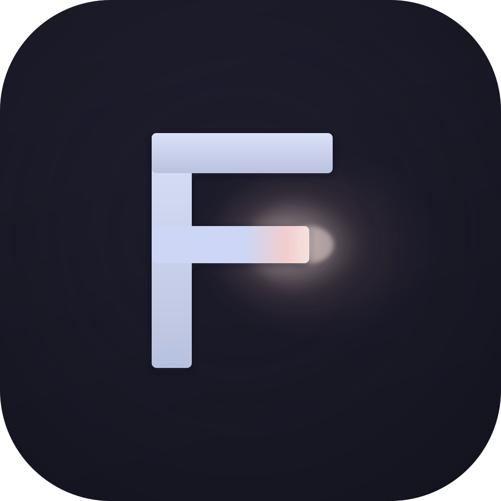

<p align="center">
  
</p>

<h1 align="center">FluxTerm</h1>

<p align="center">
  GPU-accelerated macOS terminal emulator built with Swift and Metal.
</p>

<p align="center">
  <a href="https://github.com/faizal97/flux-term/releases/latest"></a>
  
  
  <a href="LICENSE"></a>
</p>

---

FluxTerm renders every frame on the GPU using Metal shaders — backgrounds, glyphs, cursor bloom, and selection highlights are all drawn in a 3-pass instanced pipeline synced to your display's refresh rate.

## Features

**Rendering**
- Metal GPU-accelerated rendering with 3-pass instanced draw calls
- Glyph atlas with CoreText rasterization (1024×1024 texture cache)
- Triple-buffered frames synced via CVDisplayLink
- Smooth cursor animation with sinusoidal blink and Gaussian bloom glow
- Retina display support with proper point/pixel coordinate handling

**Terminal**
- Full VT100/xterm emulation via [SwiftTerm](https://github.com/migueldeicaza/SwiftTerm)
- `xterm-256color` with 16 ANSI colors + true color
- 10,000-line scrollback buffer
- Dynamic grid resizing on window resize
- Auto-detects your shell from `$SHELL`

**Input**
- Full keyboard encoding: F1–F12, arrow keys with modifiers, Ctrl+letter, Alt+key, Shift+Tab
- Text selection with mouse drag
- Copy/paste (Cmd+C / Cmd+V)
- Font size controls (Cmd+Plus / Cmd+Minus)

**UI**
- Catppuccin Mocha theme with premium glass window chrome
- Hidden title bar with inset traffic lights
- Live URL detection — Cmd+Click to open links
- Custom geometric "F" monogram app icon with bloom glow

## Install

**Homebrew**

```bash
brew tap faizal97/tap
brew install fluxterm
```

**From source**

```bash
git clone https://github.com/faizal97/flux-term.git
cd flux-term
swift build -c release
```

The binary will be at `.build/release/FluxTerm`.

**Requirements:** macOS 14 (Sonoma) or later, Swift 5.9+

## Architecture

```
Sources/FluxTerm/
├── App/                    # Entry point, app delegate, menu bar
├── Renderer/               # Metal pipeline, shaders, glyph atlas
│   ├── MetalRenderer.swift     3-pass instanced rendering
│   ├── Shaders.metal           Background, glyph, cursor, bloom shaders
│   ├── GlyphAtlas.swift        CoreText glyph rasterization + caching
│   ├── ShaderTypes.swift       CPU ↔ GPU data structures
│   └── TerminalMetalView.swift CAMetalLayer + event handling
├── Terminal/               # Session, input encoding, config
│   ├── TerminalSession.swift       PTY management via SwiftTerm
│   ├── TerminalViewController.swift Main controller
│   ├── KeyEncoder.swift            VT100 escape sequence encoding
│   ├── TerminalConfig.swift        Theme, colors, fonts
│   └── URLDetector.swift           Regex-based URL detection
├── UI/                     # Window configuration
│   └── MainWindow.swift
└── Resources/
    └── AppIcon.png
```

## Color Palette

FluxTerm uses [Catppuccin Mocha](https://catppuccin.com/):

| Element    | Color                                                        |
|------------|--------------------------------------------------------------|
| Background |  `#1E1E2E` |
| Foreground |  `#CDD6F4` |
| Cursor     |  `#F5E0DC` |
| URLs       |  `#89B4FA` |
| Selection  |  `#313244` |

## License

[MIT](LICENSE)
